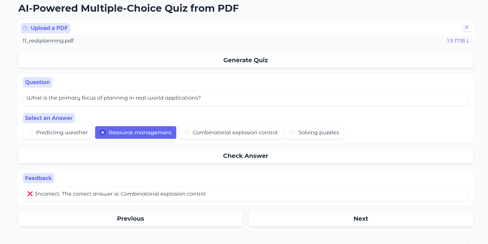

# AI-Powered Multiple-Choice Quiz Generator from PDF

This project is an AI-powered application that generates multiple-choice quizzes from PDF documents. It uses OpenAI's GPT model to extract text from the PDF and create a set of quiz questions with four answer options each. The user can interact with the quiz through a Gradio-based web interface, answer the questions, and receive instant feedback on their responses.

---

## Features

- **PDF Text Extraction**: Extracts text from uploaded PDF files using `PyPDF2` or `pdfplumber`.
- **AI-Powered Quiz Generation**: Uses OpenAI's GPT model to generate multiple-choice questions from the extracted text.
- **Interactive Quiz Interface**: Built with Gradio, the interface allows users to:
  - Upload a PDF file.
  - Generate a quiz.
  - Navigate through questions using "Previous" and "Next" buttons.
  - Select answers and receive instant feedback.

---

